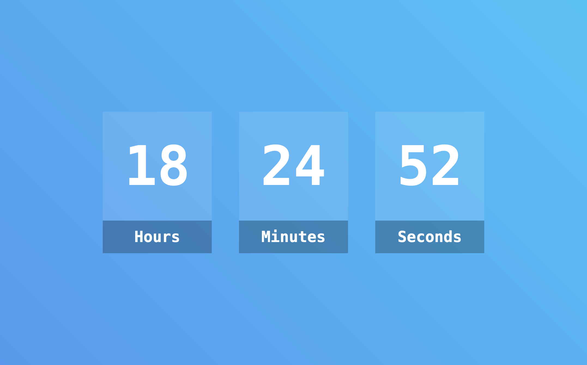

# Simple Digital Clock

## Summary
This is a simple digital clock project created with HTML, CSS, and JavaScript. It displays the current time and updates in real-time.

## Project Link
[Simple Digital Clock](https://billalben.github.io/digital-clock/)

## Screenshot

## Features
- Real-time display of the current time.
- Minimalistic and user-friendly design.
- 24-hour format for accurate time representation.
- Responsive layout for different screen sizes.

